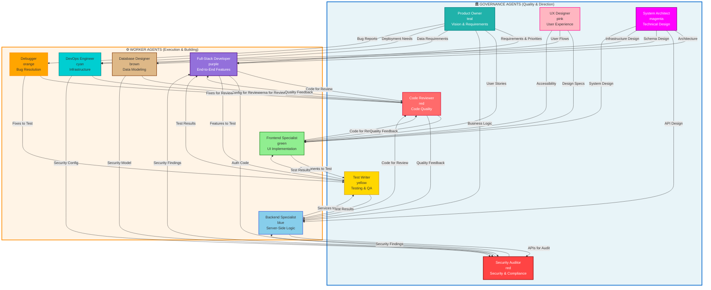
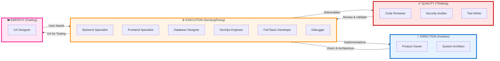
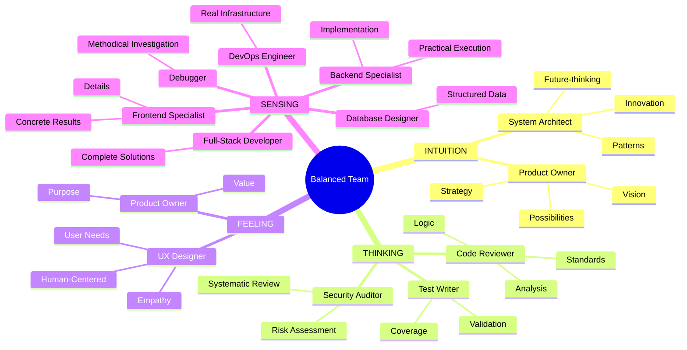
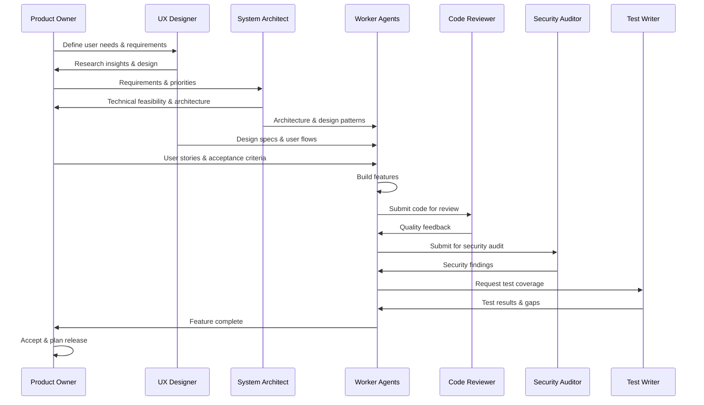

# Agent Team Architecture

> ## **Agentic Pattern: The Worker-Governance Pattern**
>
> *"Equal Halves make the whole, neither side takes control."*

This document describes the balanced 6/6 agent team based on **Jungian psychology principles** for optimal motivation and innovation.

## Core Principle

The **Worker-Governance Pattern** creates equilibrium between:
- **6 Worker Agents** (Sensing) - Execution, implementation, practical building
- **6 Governance Agents** (Intuition + Thinking + Feeling) - Vision, quality, validation

**Neither side dominates. Both sides collaborate. The whole emerges from equal halves.**

```
┌────────────────────┐                    ┌────────────────────┐
│                    │                    │                    │
│  WORKERS (6)       │  ←── Balance ──→   │  GOVERNANCE (6)    │
│                    │                    │                    │
│  🔧 Execution      │                    │  🎯 Direction      │
│  🔵 Sensing        │                    │  💜 Intuition      │
│  ⚙️  Build         │                    │  🔴 Thinking       │
│  📦 Implement      │                    │  🩷 Feeling        │
│                    │                    │                    │
└────────────────────┘                    └────────────────────┘

         Equal Halves          =          Complete Team (12)
```

### Why This Pattern Works

1. **Prevents Execution Without Vision** - Workers build what governance defines
2. **Prevents Vision Without Execution** - Governance depends on workers to realize ideas
3. **Prevents Quality Paralysis** - Equal voting power means pragmatic compromises
4. **Promotes Innovation** - Diverse cognitive functions spark creative solutions
5. **Ensures Sustainability** - Balanced workload across thinking styles

## Team Balance: Worker Agents (Execution) ↔ Governance Agents (Quality & Direction)



## Alternative View: Yin-Yang Balance



## Jungian Cognitive Functions Mapping



## Work Flow: From Vision to Delivery



## Team Dynamics

### Worker Agents (Execution Layer)
- **Focus**: Building, implementing, fixing
- **Psychology**: Sensing (practical, concrete, detailed)
- **Output**: Code, infrastructure, solutions

### Governance Agents (Quality & Direction Layer)

#### Strategic Governance (Intuition)
- **Product Owner**: What to build, why it matters
- **System Architect**: How to structure it

#### Technical Governance (Thinking)
- **Code Reviewer**: Is it well-written?
- **Security Auditor**: Is it secure?
- **Test Writer**: Does it work correctly?

#### Human Governance (Feeling)
- **UX Designer**: Does it serve users well?

## Key Relationships

| Worker Agent | Primary Governance Partners |
|--------------|---------------------------|
| Frontend Specialist | UX Designer, Code Reviewer |
| Backend Specialist | System Architect, Security Auditor |
| Database Designer | System Architect, Code Reviewer |
| DevOps Engineer | System Architect, Security Auditor |
| Full-Stack Developer | All Governance Agents |
| Debugger | Code Reviewer, Test Writer |

## Balance Principles

1. **6 Workers + 6 Governance = Complete Team**
2. **Thinking (4) + Feeling (2) = Balanced Decision Making**
3. **Execution (6) + Direction (2) + Quality (4) = Sustainable Delivery**
4. **Technical Focus + User Focus = Valuable Products**

---

## The Worker-Governance Pattern: Summary

> ### *"Equal Halves make the whole, neither side takes control."*

The **Worker-Governance Pattern** represents a fundamental breakthrough in agentic engineering:

### The Problem It Solves

**Traditional Approaches:**
- ❌ All-worker teams → No vision, no quality checks, reactive firefighting
- ❌ All-governance teams → Analysis paralysis, no execution, endless planning
- ❌ Unbalanced teams → Dominant side creates bottlenecks and blind spots

### The Solution

**Equal Halves (6+6):**
- ✅ Workers execute what governance defines
- ✅ Governance guides what workers build
- ✅ Neither side can dominate decisions
- ✅ Forced collaboration creates better outcomes
- ✅ Psychological balance prevents burnout

### The Result

A **self-balancing system** where:
1. **Vision** meets **Execution**
2. **Quality** enables **Velocity**
3. **Innovation** grounds in **Reality**
4. **Strategy** realizes through **Action**

### Application Beyond AI Agents

This pattern applies to:
- **Human teams** - Balance makers with checkers
- **Organizations** - Equal power between doers and overseers
- **Personal productivity** - Alternate between execution and reflection
- **System design** - Balance compute with orchestration

### The Core Truth

**Neither half is complete alone.**

Workers without governance build the wrong things efficiently.
Governance without workers produces beautiful plans that never ship.

**Together, as equal halves, they make the whole.**

---

*This pattern is released into the public domain. Use it, adapt it, share it.*
