# Agent Team Architecture

This document describes the balanced 6/6 agent team based on Jungian psychology principles for optimal motivation and innovation.

## Team Balance: Worker Agents (Execution) ↔ Governance Agents (Quality & Direction)

```mermaid
graph TB
    subgraph GOVERNANCE["🏛️ GOVERNANCE AGENTS (Quality & Direction)"]
        PO[Product Owner<br/>teal<br/>Vision & Requirements]
        UX[UX Designer<br/>pink<br/>User Experience]
        SA[System Architect<br/>magenta<br/>Technical Design]
        CR[Code Reviewer<br/>red<br/>Code Quality]
        SEC[Security Auditor<br/>red<br/>Security & Compliance]
        TW[Test Writer<br/>yellow<br/>Testing & QA]
    end

    subgraph WORKERS["⚙️ WORKER AGENTS (Execution & Building)"]
        FS[Full-Stack Developer<br/>purple<br/>End-to-End Features]
        FE[Frontend Specialist<br/>green<br/>UI Implementation]
        BE[Backend Specialist<br/>blue<br/>Server-Side Logic]
        DB[Database Designer<br/>brown<br/>Data Modeling]
        DO[DevOps Engineer<br/>cyan<br/>Infrastructure]
        BG[Debugger<br/>orange<br/>Bug Resolution]
    end

    %% Product Owner defines work
    PO -->|Requirements & Priorities| FS
    PO -->|User Stories| FE
    PO -->|Business Logic| BE
    PO -->|Data Requirements| DB
    PO -->|Deployment Needs| DO
    PO -->|Bug Reports| BG

    %% UX Designer guides user experience
    UX -->|Design Specs| FE
    UX -->|User Flows| FS
    UX -->|Accessibility| FE

    %% System Architect provides technical direction
    SA -->|Architecture| FS
    SA -->|API Design| BE
    SA -->|Schema Design| DB
    SA -->|Infrastructure Design| DO
    SA -->|System Design| FE

    %% Code Reviewer validates quality
    FS -->|Code for Review| CR
    FE -->|Code for Review| CR
    BE -->|Code for Review| CR
    DB -->|Schema for Review| CR
    DO -->|Config for Review| CR
    BG -->|Fixes for Review| CR

    %% Security Auditor ensures security
    BE -->|APIs for Audit| SEC
    FS -->|Auth Code| SEC
    DB -->|Security Model| SEC
    DO -->|Security Config| SEC

    %% Test Writer validates functionality
    FS -->|Features to Test| TW
    FE -->|Components to Test| TW
    BE -->|Services to Test| TW
    BG -->|Fixes to Test| TW

    %% Feedback loops
    CR -->|Quality Feedback| FS
    CR -->|Quality Feedback| FE
    CR -->|Quality Feedback| BE
    SEC -->|Security Findings| BE
    SEC -->|Security Findings| FS
    TW -->|Test Results| FS
    TW -->|Test Results| BE
    TW -->|Test Results| FE

    style GOVERNANCE fill:#e8f4f8,stroke:#0066cc,stroke-width:3px
    style WORKERS fill:#fff4e6,stroke:#ff8c00,stroke-width:3px

    style PO fill:#20b2aa,stroke:#008080,stroke-width:2px,color:#fff
    style UX fill:#ffb6c1,stroke:#ff1493,stroke-width:2px
    style SA fill:#ff00ff,stroke:#8b008b,stroke-width:2px,color:#fff
    style CR fill:#ff6b6b,stroke:#dc143c,stroke-width:2px,color:#fff
    style SEC fill:#ff4444,stroke:#8b0000,stroke-width:2px,color:#fff
    style TW fill:#ffd700,stroke:#daa520,stroke-width:2px

    style FS fill:#9370db,stroke:#4b0082,stroke-width:2px,color:#fff
    style FE fill:#90ee90,stroke:#228b22,stroke-width:2px
    style BE fill:#87ceeb,stroke:#4169e1,stroke-width:2px
    style DB fill:#deb887,stroke:#8b4513,stroke-width:2px
    style DO fill:#00ced1,stroke:#008b8b,stroke-width:2px
    style BG fill:#ffa500,stroke:#ff8c00,stroke-width:2px
```

## Alternative View: Yin-Yang Balance

## Jungian Cognitive Functions Mapping

## Work Flow: From Vision to Delivery

## Team Dynamics

### Worker Agents (Execution Layer)
- **Focus**: Building, implementing, fixing
- **Psychology**: Sensing (practical, concrete, detailed)
- **Output**: Code, infrastructure, solutions

### Governance Agents (Quality & Direction Layer)

#### Strategic Governance (Intuition)
- **Product Owner**: What to build, why it matters
- **System Architect**: How to structure it

#### Technical Governance (Thinking)
- **Code Reviewer**: Is it well-written?
- **Security Auditor**: Is it secure?
- **Test Writer**: Does it work correctly?

#### Human Governance (Feeling)
- **UX Designer**: Does it serve users well?

## Key Relationships

| Worker Agent | Primary Governance Partners |
|--------------|---------------------------|
| Frontend Specialist | UX Designer, Code Reviewer |
| Backend Specialist | System Architect, Security Auditor |
| Database Designer | System Architect, Code Reviewer |
| DevOps Engineer | System Architect, Security Auditor |
| Full-Stack Developer | All Governance Agents |
| Debugger | Code Reviewer, Test Writer |

## Balance Principles

1. **6 Workers + 6 Governance = Complete Team**
2. **Thinking (4) + Feeling (2) = Balanced Decision Making**
3. **Execution (6) + Direction (2) + Quality (4) = Sustainable Delivery**
4. **Technical Focus + User Focus = Valuable Products**
